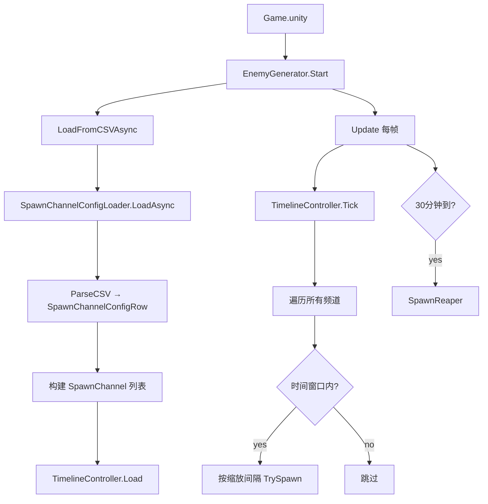

# 时间轴刷怪系统（v2.0 — 模仿吸血鬼幸存者）

相关文档：
- 配置使用指南：`Docs/EnemyWaveConfig-Guide.md`
- 难度公式常量：`Assets/Scripts/Config/Config.cs`

## 核心概念

从「顺序波次制」重构为「**时间轴驱动制**」：

- **无需清波**：敌人刷新完全由游戏时钟 (`Global.CurrentSeconds`) 驱动
- **多频道并行**：不同敌人类型在各自的时间窗口内同时活跃
- **难度自动递增**：HP/速度/伤害/刷新频率随时间持续增长
- **30 分钟**一局，到时出现死神

## 配置数据源

- 主配置：`Assets/StreamingAssets/Config/EnemyWaveConfig.csv`
- 解析：`SpawnChannelConfigLoader.ParseCSV()` → `SpawnChannelConfigRow`
- 控制器：`TimelineController`（纯 C#）
- 生成：`EnemyGenerator.Start()` → `LoadFromCSVAsync()` → `Update()`

## CSV 列定义

| 列名 | 含义 | 默认值 |
|---|---|---|
| ChannelName | 频道名称（UI 显示用） | — |
| Active | 是否启用 | — |
| EnemyPrefabName | 预制体 Key | — |
| Phase | small / boss | 自动推断 |
| StartTimeSec | 激活时间（游戏秒） | — |
| EndTimeSec | 结束时间（-1 = 不结束） | — |
| SpawnIntervalSec | 刷新间隔（受难度缩放） | 1.0 |
| SpawnCount | 总数量限制（0 = 无限） | 0 |
| HPScale / SpeedScale / DamageScale | 基础倍率 | 1.0 |
| BaseSpeed | 基础移动速度 | 2.0 |
| IsTreasureChest | 掉宝箱 | FALSE |
| ExpDropRate / CoinDropRate / HpDropRate / BombDropRate | 掉落概率 | 0.3/0.3/0.1/0.05 |

## 难度递增公式

| 属性 | 公式 | 常量 |
|---|---|---|
| HP | `HPScale × (1 + 0.25 × t)` | `HPGrowthPerMinute` |
| Speed | `SpeedScale × (1 + 0.05 × t)` | `SpeedGrowthPerMinute` |
| Damage | `DamageScale × (1 + 0.15 × t)` | `DamageGrowthPerMinute` |
| 刷新间隔 | `SpawnIntervalSec / (1 + 0.1 × t)` | `SpawnRateGrowthPerMinute` |

其中 `t` 为游戏经过的分钟数。

## 调用链

## 死神机制

- 触发时间：`Config.ReaperSpawnTimeSeconds`（1800s）
- 预制体：`Enemy_Reaper`
- 属性：HP=99999, Damage=999, Speed=5
- 仅生成一次

## UI 映射

| 属性 | 来源 | 描述 |
|---|---|---|
| `CurrentMinute` | `TimelineController.Tick` | 当前分钟数 |
| `ActiveChannelNames` | `TimelineController.Tick` | 当前活跃频道名（逗号分隔） |
| `GameRemainingTime` | `TimelineController.Tick` | 距 30 分钟结束剩余秒数 |
| `ActiveChannelCount` | `TimelineController.Tick` | 当前活跃频道数 |

向后兼容别名：`CurrentWaveIndex` → `CurrentMinute`，`CurrentWaveName` → `ActiveChannelNames`，`WaveRemainingTime` → `GameRemainingTime`
