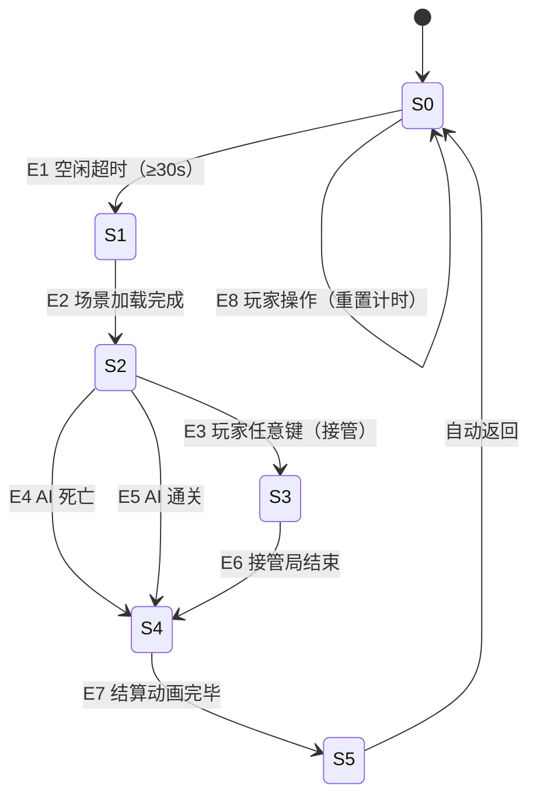

# PRD · 轮回见证者（Attract Mode）

| 字段 | 内容 |
|------|------|
| 功能名称 | 轮回见证者 Attract Mode |
| 所属模块 | 标题界面 / 自动游玩代理 |
| 文档状态 | 草稿 |
| 创建日期 | 2026-03-20 |
| 参考方案 | `Docs/AutoplayAgent-Design.md` · 方案 A |

---

## 1. 概述

**轮回见证者**是一个在标题界面触发的自动演示功能。当玩家在标题界面超过 **30 秒无操作**时，游戏自动进入见证模式——由 AI 代替玩家开始一局游戏，全程展示战斗画面。

玩家可：
- 全程旁观，随时按任意键**无缝接管**该局
- 不接管时，待 AI 游玩结束后自动返回标题界面
- 通过接管与旁观累积专属成就

**设计目标**：让初次打开游戏的玩家在标题界面就能看到游戏核心乐趣（大量敌人、武器特效、升级面板），降低上手心理门槛；同时为熟练玩家提供"旁观学习"的低压力娱乐体验。

---

## 2. 概念与术语

### 2.1 核心实体

| 术语 | 英文 | 定义 |
|------|------|------|
| 见证模式 | Witness Mode | 由 AI 控制角色游玩的整体运行状态，包含演示游玩与玩家接管两个子阶段 |
| 见证局 | Witness Run | 见证模式下 AI 完整游玩的一局（从进入战斗到 AI 死亡或通关） |
| 接管 | Takeover | 玩家在见证模式中主动恢复对角色的控制权 |
| 见证接管局 | Witnessed Run | 玩家接管后继续游玩的局，与普通局有所区分 |
| 空闲计时器 | Idle Timer | 记录玩家在标题界面无操作时长的计时器，达到阈值触发见证模式 |
| AI 风格 | AI Style | AI 本局采用的预设行为策略，决定移动优先级与升级选择倾向 |
| 演示 Build | Demo Build | AI 在见证局中选择的武器/能力组合，每局从预设列表中轮转 |
| 人性化失误 | Human Error | AI 以一定概率触发的"轻度失误"行为，使演示看起来不过于完美 |

### 2.2 状态变量

| 变量 | 类型 | 默认值 | 说明 |
|------|------|--------|------|
| `idleSeconds` | float | 0 | 玩家在标题界面的累计无操作秒数 |
| `isWitnessMode` | bool | false | 当前是否处于见证模式 |
| `isTakenOver` | bool | false | 玩家是否已接管本局 |
| `currentDemoBuildIndex` | int | 0 | 当前轮转到的演示 Build 序号 |
| `witnessWatchSeconds` | float | 0 | 本次会话中玩家累计旁观秒数（用于成就判定） |
| `aiStyleId` | string | "balanced" | 本局 AI 风格标识符 |

---

## 3. 状态

### 3.1 状态定义

| ID | 状态名 | 描述 |
|----|--------|------|
| S0 | **标题待机** | 玩家停留在标题界面，空闲计时器运行中 |
| S1 | **见证准备** | 空闲计时器达到阈值，正在加载战斗场景 |
| S2 | **AI 演示中** | AI 控制角色游玩，玩家为旁观者 |
| S3 | **玩家接管中** | 玩家已接管，以"见证接管局"身份正常游玩 |
| S4 | **见证结算** | AI 死亡或通关后，显示结算画面（简化版），准备返回 |
| S5 | **返回标题** | 结算完成，场景切回标题界面，重置空闲计时器 |

### 3.2 事件定义

| ID | 事件名 | 触发条件 | 触发来源 |
|----|--------|----------|----------|
| E1 | 空闲超时 | `idleSeconds >= 30` | 系统（计时器） |
| E2 | 场景加载完成 | 战斗场景异步加载结束 | 系统 |
| E3 | 玩家输入任意键 | 键盘/手柄任意按键或鼠标点击 | 玩家 |
| E4 | AI 角色死亡 | AI 控制的角色 HP 归零 | 游戏逻辑 |
| E5 | AI 通关 | 最后一波敌人清空 | 游戏逻辑 |
| E6 | 接管局结束 | 玩家死亡或通关 | 游戏逻辑 |
| E7 | 结算动画完毕 | 结算界面展示 3 秒后 | 系统 |
| E8 | 玩家在标题操作 | 玩家点击标题界面任意菜单按钮 | 玩家 |

### 3.3 状态转移表

| 当前状态 | 事件 | 条件 | 动作 | 目标状态 |
|----------|------|------|------|----------|
| S0 标题待机 | E1 空闲超时 | — | 选取下一个演示 Build；加载战斗场景 | S1 见证准备 |
| S0 标题待机 | E8 玩家在标题操作 | — | 重置 `idleSeconds = 0` | S0 标题待机 |
| S1 见证准备 | E2 场景加载完成 | — | AI 开始控制角色；显示见证模式 UI | S2 AI 演示中 |
| S2 AI 演示中 | E3 玩家输入任意键 | `isTakenOver == false` | 移交控制权给玩家；标记 `isTakenOver = true`；隐藏接管提示 | S3 玩家接管中 |
| S2 AI 演示中 | E4 AI 角色死亡 | — | 播放死亡动画；进入简化结算 | S4 见证结算 |
| S2 AI 演示中 | E5 AI 通关 | — | 播放通关演出；进入简化结算 | S4 见证结算 |
| S3 玩家接管中 | E6 接管局结束 | — | 进入正常结算（标注"见证接管局"）；不写入排行榜 | S4 见证结算 |
| S4 见证结算 | E7 结算动画完毕 | — | 切回标题场景；重置所有状态变量 | S5 返回标题 |
| S5 返回标题 | —（自动） | — | 重置 `idleSeconds = 0`；恢复标题界面 | S0 标题待机 |

### 3.4 状态图

---

## 4. 交互

### 4.1 标题界面

| 操作 | 行为 |
|------|------|
| 鼠标移动 / 任意键盘按键 / 手柄输入 | 重置空闲计时器，不触发见证模式 |
| 点击标题界面任意按钮（开始/设置/成就等） | 重置空闲计时器，正常进入对应流程 |

### 4.2 见证模式中（S2 AI 演示中）

| 操作 | 行为 |
|------|------|
| 键盘任意键 / 手柄任意键 / 鼠标任意点击 | 触发**接管**，角色控制权立刻交给玩家（下一帧生效） |
| 无操作 | 继续旁观，`witnessWatchSeconds` 持续累加 |

> **注意**：接管操作没有确认弹窗，直接生效。避免在紧张时刻（如接管时 AI 正被围攻）增加额外摩擦。

### 4.3 接管后（S3 玩家接管中）

与正常游玩完全一致（WASD 移动，升级面板点击选择），但：
- 游戏界面顶部保留小型标签："见证接管局（不计入排行榜）"
- 升级面板不特殊处理，正常显示

---

## 5. 反馈

### 5.1 视觉反馈

| 触发条件 | 视觉表现 | 位置 |
|----------|----------|------|
| 进入 S2（AI 演示开始） | 屏幕四角出现半透明金色边框光晕（持续整个见证局） | 全屏边缘 |
| 进入 S2 | 左上角显示标签："👁 轮回见证中" （半透明，约 60% 不透明度） | 左上角 |
| S2 持续中 | 右下角常驻提示："按任意键接管" （半透明，缓慢呼吸动画） | 右下角 |
| AI 升级选择时 | 升级面板正常弹出；AI 选择时，目标选项短暂高亮 0.5 秒后自动确认 | 正常升级面板位置 |
| 玩家接管（S3） | 金色边框消失；右下角提示替换为："见证接管局（不计入排行榜）" | 右下角 |
| AI 死亡（→S4） | 正常死亡画面，但结算标题改为："见证结算" | 结算界面 |
| AI 通关（→S4） | 正常通关画面，但结算标题改为："见证通关" | 结算界面 |

### 5.2 音效反馈

| 触发条件 | 音效 |
|----------|------|
| 进入见证模式（S1→S2） | 播放一段短促的"启动音"（建议使用现有 UI 确认音效） |
| 玩家接管瞬间 | 播放接管音效（建议使用现有升级/解锁类音效） |
| 见证结算结束，返回标题 | 无额外音效，沿用现有场景切换逻辑 |

### 5.3 成就解锁反馈

成就解锁时机均在游戏内通用成就弹窗系统中展示（现有 `AchievementSystem`）。

---

## 6. 规则

**R1 · 见证局不计入正式成绩**
见证局（包括接管后的见证接管局）的结果不写入本地排行榜，不更新最高分、最长存活时间等成就统计数据。唯一例外：接管后触发的**见证专属成就**（见第 7 节）正常记录。

**R2 · 演示 Build 轮转**
每次进入见证模式，从预设演示 Build 列表（见第 8 节）中按序取下一个 Build 作为本局 AI 的升级方向。轮转为环形，列表末尾后回到第一个。目的：让重复旁观的玩家每次看到不同的武器组合。

**R3 · 接管状态完整继承**
玩家接管时，角色的所有当前状态（HP、等级、已解锁武器/被动、位置、场上敌人）原样保留，不作任何重置或调整。玩家接手的是"真实的战场"，而非重置状态。

**R4 · 见证局不触发存档**
见证局期间，`SaveSystem` 不执行任何写入操作。接管后的见证接管局同样不触发存档（金币、成就除见证专属外不变动）。

**R5 · 标题界面主动操作阻断见证模式启动**
若玩家在倒计时（S0）期间点击了标题界面任意按钮，计时器重置，不进入 S1。若玩家在 S1（加载中）期间操作，加载完成后立即返回标题，不进入 S2。

**R6 · 人性化失误不影响核心展示节点**
AI 失误（R 见第 8.2 节）仅发生在普通战斗走位阶段。以下情境 AI 不触发失误：Boss 战全程、HP 低于 30% 时、升级选择面板弹出时。

---

## 7. 成就系统

成就均通过现有 `AchievementSystem.OnInit()` 注册，见证局期间专项计数器独立追踪，不污染正式局数据。

| 成就 ID | 名称 | 解锁条件 | 备注 |
|---------|------|----------|------|
| `ACH_WITNESS_WATCH` | **轮回旁观者** | 累计旁观 AI 游玩时长 ≥ 10 分钟 | 跨会话累计，`witnessWatchSeconds` 存入存档 |
| `ACH_WITNESS_TAKEOVER_SURVIVE` | **最后的守护** | 在 AI HP ≤ 15% 时接管，并在接管后存活 ≥ 60 秒 | 单局判定 |
| `ACH_WITNESS_TAKEOVER_CLEAR` | **见证者的意志** | 接管后完成通关 | 单局判定 |
| `ACH_WITNESS_OBSERVE_BOSS` | **旁观神迹** | 旁观 AI 击败 Boss（不接管） | 单局判定，AI 必须是击杀者 |
| `ACH_WITNESS_ALL` | **轮回见证者** | 解锁以上全部 4 个成就 | 综合成就，解锁专属称号"轮回见证者" |

---

## 8. AI 行为规格

### 8.1 移动策略

AI 每帧根据当前场上敌人的空间分布，计算**8 个方向的威胁值**，选择威胁值最低的方向移动。

威胁值参考因素（按优先级排序）：
1. 方向前方 3 格内的敌人数量
2. 当前方向是否临近地图边界
3. Boss 的位置（Boss 方向附加额外威胁权重）

> AI 始终保持移动，不会原地站桩——这符合类幸存者游戏的视觉期待，避免演示看起来像"挂机"。

### 8.2 人性化失误

每 **10 秒**进行一次失误判定，基础触发概率 **8%**。触发时从以下行为中随机选取一种执行：

| 失误类型 | 表现 | 持续时间 |
|----------|------|----------|
| 短暂冲入敌群 | AI 向威胁值最高的方向移动 | 0.8 秒 |
| 升级时短暂"犹豫" | AI 延迟 1.5 秒后再确认升级选择 | 1.5 秒 |
| 转向犹豫 | AI 在两个相近方向之间短暂来回走 | 1.0 秒 |

失误概率随以下情况**清零**（见 R6）：
- AI HP ≤ 30%
- 当前局时间 > 15 分钟（Boss 阶段）
- 升级选择面板开启中

### 8.3 升级选择策略

AI 根据当前演示 Build 的预设优先级列表选择升级项。选择逻辑：
1. 优先选择演示 Build 内尚未解锁的核心武器
2. 核心武器满级后，选择 Build 内的配对被动
3. 所有预设项均选完后，退化为随机选择

### 8.4 演示 Build 列表

共 5 套预设演示 Build，按 R2 轮转：

| 序号 | Build 名称 | 核心武器 | 展示重点 |
|------|-----------|----------|----------|
| 0 | 旋风剑士 | RotateSword + SimpleSword | 近战环绕 + 直线剑气 |
| 1 | 飞刀狂雨 | SimpleKnife + SimpleBow | 高频远程投射 |
| 2 | 斧爆流 | SimpleAxe + SuperBomb | 范围爆炸清屏 |
| 3 | 魔法师 | MagicWand + HolyWater | 减速区域控制 |
| 4 | 杂技团 | BasketBall + Boomerang | 弹射回旋视觉效果 |

---

## 9. 数值配置

以下数值以配置形式单独管理，无需改代码即可调整：

| 参数 | 默认值 | 范围建议 | 说明 |
|------|--------|----------|------|
| 空闲触发时长 | 30 秒 | 15～60 秒 | 过短会打断玩家思考，过长失去吸引力 |
| AI 失误基础概率 | 8% | 3%～15% | 过低太完美，过高像新手 |
| AI 失误判定间隔 | 10 秒 | 5～20 秒 | — |
| 接管提示呼吸动画周期 | 2 秒 | 1.5～3 秒 | — |
| 见证结算停留时长 | 3 秒 | 2～5 秒 | 太短看不清，太长节奏拖沓 |
| 演示 Build 数量 | 5 | ≥ 3 | 少于 3 个时重复感过强 |
| AI HP 失误豁免阈值 | 30% | 20%～40% | — |

---

## 10. 待确认问题

以下问题在实现前需与项目组确认：

- [ ] **Q1**：接管后通关，是否给予正式的金币/成就奖励？目前方案为"不给予"，但可能降低接管动力。
- [ ] **Q2**：移动端（Android）是否需要触屏版接管手势？当前方案为"任意触屏"触发接管，是否会与旁观滑动屏幕产生误触？
- [ ] **Q3**：演示 Build 的 5 套方案是否与当前已实装武器对应？需确认 `RotateSword`、`BasketBall` 等在当前版本是否完整可用。
- [ ] **Q4**：见证模式是否需要跳过开场动画（如有），直接进入战斗？
- [ ] **Q5**：`witnessWatchSeconds` 的累计数据是否需要存档（跨会话累计）？若存档，使用哪个 PlayerPrefs key？

---

## 11. 验收检查

### 触发与状态

- [ ] 标题界面静止 30 秒后自动进入见证模式
- [ ] 标题界面任意操作正确重置计时器
- [ ] 场景加载期间的玩家操作正确阻断见证模式进入
- [ ] 返回标题后计时器从 0 开始重新计时

### AI 行为

- [ ] AI 全程保持移动，不出现站桩
- [ ] AI 选择升级时，高亮目标项后延迟确认（非瞬间点击）
- [ ] 失误行为在 Boss 阶段、低 HP 时不触发
- [ ] 演示 Build 按轮转顺序切换，不重复

### 接管

- [ ] 任意键触发接管，下一帧角色响应玩家输入
- [ ] 接管时角色 HP / 等级 / 武器 / 位置与接管前完全一致
- [ ] 接管后界面正确显示"见证接管局"标签
- [ ] 接管局结果不写入排行榜

### 反馈

- [ ] 金色边框光晕在 S2 全程可见，接管后消失
- [ ] "按任意键接管"提示有呼吸动画
- [ ] 升级面板弹出时 AI 选择项有高亮动画
- [ ] 进入见证模式和接管时分别播放对应音效

### 成就

- [ ] `ACH_WITNESS_WATCH`：旁观时长跨会话累计正确
- [ ] `ACH_WITNESS_TAKEOVER_SURVIVE`：接管时 HP 判定准确（≤ 15%）
- [ ] `ACH_WITNESS_TAKEOVER_CLEAR`：接管后通关正确触发
- [ ] `ACH_WITNESS_OBSERVE_BOSS`：AI（非玩家）击杀 Boss 时正确触发
- [ ] `ACH_WITNESS_ALL`：4 个子成就全部解锁后触发综合成就

### 存档安全

- [ ] 见证局全程 `SaveSystem` 无写入（断点验证）
- [ ] 接管局金币、正式成就数据不变动
