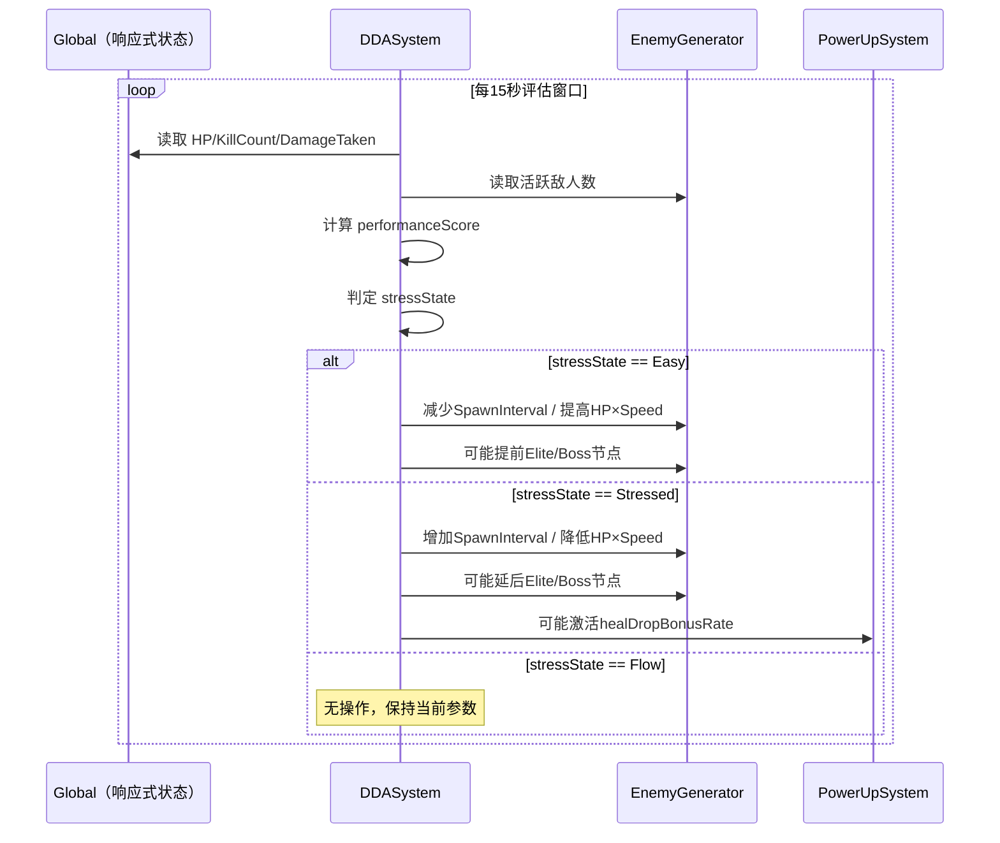

# PRD · 动态难度调整 AI（Dynamic Difficulty Adjustment）

| 字段 | 内容 |
|------|------|
| 功能名称 | 动态难度调整 AI（DDA） |
| 所属模块 | 游戏系统 / 难度控制 |
| 文档状态 | 草稿 |
| 创建日期 | 2026-03-20 |
| 参考方案 | `Docs/AI-Features-Ideas.md` · 第 1 条 |

---

## 1. 概述

**动态难度调整 AI（DDA）** 是一个在每局游戏中实时运行的难度调控系统。它持续监控玩家表现指标，判断玩家当前处于「太轻松」、「心流区间」还是「太困难」三种状态之一，并自动调整敌人生成参数和掉落率，使游戏体验始终维持在**心流区间**（Flow Channel）。

**设计目标**：
- 新手玩家不会因为早期太难而放弃
- 熟练玩家不会因为前期太轻松而无聊
- 每局游戏的难度弧线自然流畅，而非"要么太简单要么突然死亡"
- 调整手段隐性、自然，玩家感受到的是"这局手感很顺"，而非"系统在帮我"

**调整原则**：DDA 只能在已配置的参数范围内微调，**不改变游戏的底层数值平衡**（武器伤害、玩家基础属性等保持不变），只影响**敌人生成密度、属性缩放和掉落率**。

---

## 2. 概念与术语

### 2.1 核心实体

| 术语 | 英文 | 定义 |
|------|------|------|
| 心流区间 | Flow Channel | 玩家既不感到无聊也不感到挫败的挑战强度范围，DDA 的目标区间 |
| 难度评分 | Difficulty Score | DDA 系统计算出的当前局面难度压力数值，综合多项指标得出 |
| 表现评分 | Performance Score | 基于玩家实时表现计算的综合得分，决定 DDA 的调整方向 |
| 压力状态 | Stress State | 当前玩家所处的难度感知状态：`轻松 / 心流 / 受压` |
| DDA 增益 | DDA Boost | DDA 判断玩家"太轻松"时施加的敌人强化修正 |
| DDA 减益 | DDA Relief | DDA 判断玩家"太困难"时施加的敌人减弱修正 |
| 检测窗口 | Evaluation Window | DDA 计算表现评分时采用的时间滑动窗口（默认 15 秒） |
| 冷却期 | Cooldown | 两次 DDA 调整之间的最小间隔，防止调整频率过高导致体验抖动 |

### 2.2 状态变量

| 变量 | 类型 | 默认值 | 说明 |
|------|------|--------|------|
| `ddaEnabled` | bool | true | 当前局是否启用 DDA（玩家可在设置中关闭） |
| `performanceScore` | float | 0.5 | 归一化表现评分，范围 [0, 1]，0.5 为心流中心 |
| `stressState` | enum | `Flow` | 当前压力状态：`Easy / Flow / Stressed` |
| `spawnIntervalMultiplier` | float | 1.0 | 敌人生成间隔倍率（>1 = 减速生成，<1 = 加速生成） |
| `enemyHpMultiplier` | float | 1.0 | 敌人血量倍率（范围受限，见第 9 节） |
| `enemySpeedMultiplier` | float | 1.0 | 敌人移动速度倍率（范围受限，见第 9 节） |
| `healDropBonusRate` | float | 0.0 | 额外回血道具掉落概率加成（0 = 无加成） |
| `lastAdjustTime` | float | 0 | 上次 DDA 执行调整的游戏时间戳 |

---

## 3. 监控指标

DDA 每 **15 秒**（检测窗口）采集一次以下指标，计算出 `performanceScore`。

### 3.1 指标定义

| 指标 ID | 名称 | 数据来源 | 权重 |
|---------|------|----------|------|
| M1 | 每分钟受伤次数 | `Global.DamageTakenCount`（每帧统计） | 35% |
| M2 | 当前 HP 占比 | `Global.HP / Global.MaxHP` | 25% |
| M3 | 每分钟击杀数 | `Global.KillCount`（每帧统计） | 20% |
| M4 | 屏幕存活敌人数 | `EnemyGenerator` 当前活跃敌人数量 | 10% |
| M5 | 升级选择速度 | 升级面板弹出到点击的耗时（秒） | 10% |

### 3.2 指标归一化规则

每个指标归一化为 [0, 1] 的「压力值」，0 = 玩家状态最佳（轻松），1 = 玩家状态最差（极度受压）：

| 指标 | 归一化方式 |
|------|-----------|
| M1 受伤次数 | `clamp(hitsPerMin / 20, 0, 1)`（20次/分钟视为满压力） |
| M2 HP 占比 | `1 - HPRatio`（HP 越低，压力越高） |
| M3 击杀数 | `1 - clamp(killsPerMin / 60, 0, 1)`（60击杀/分钟视为无压力） |
| M4 敌人数量 | `clamp(activeEnemies / 150, 0, 1)`（150体视为满压力） |
| M5 升级速度 | `1 - clamp(selectionTime / 5, 0, 1)`（选择≤1秒=无聊，>5秒=全神贯注） |

**综合表现评分**（`performanceScore`）：

```
performanceScore = M1×0.35 + M2×0.25 + M3×0.20 + M4×0.10 + M5×0.10
```

> `performanceScore` 越接近 0 = 玩家越轻松；越接近 1 = 玩家越受压。

### 3.3 压力状态判定

| 压力状态 | 条件 | 含义 |
|----------|------|------|
| `Easy`（太轻松） | `performanceScore < 0.3` | 玩家几乎不受威胁，需增加挑战 |
| `Flow`（心流） | `0.3 ≤ performanceScore ≤ 0.65` | 玩家处于最佳体验区间，保持当前难度 |
| `Stressed`（受压） | `performanceScore > 0.65` | 玩家压力过大，需降低挑战 |

---

## 4. 调整手段

DDA 每次触发调整时，根据当前 `stressState` 从以下手段中**叠加应用**调整（不是选其一）。

### 4.1 敌人生成速率

通过修改 `EnemyGenerator` 的 `SpawnIntervalMultiplier` 参数（不改动 CSV 配置文件）：

| 压力状态 | 每次调整步进 | 效果 |
|----------|------------|------|
| `Easy` | -0.05（加速生成） | 缩短生成间隔，提高敌人密度 |
| `Stressed` | +0.10（减速生成） | 延长生成间隔，降低敌人密度 |

> 受压时步进比轻松时更大（0.10 vs 0.05），因为玩家受压的负面体验比无聊更强烈，需要更快响应。

### 4.2 敌人属性缩放

通过修改 `EnemyGenerator` 的 `EnemyHpMultiplier` 和 `EnemySpeedMultiplier`（仅影响新生成的敌人，不修改已在场的敌人）：

| 压力状态 | HP 步进 | 速度步进 |
|----------|---------|---------|
| `Easy` | +0.05 | +0.03 |
| `Stressed` | -0.08 | -0.05 |

### 4.3 回血道具掉落加成

仅在 `Stressed` 且 `Global.HP / Global.MaxHP < 0.35` 时激活（濒死救援机制）：

| 条件 | 效果 |
|------|------|
| 受压 + HP < 35% | `healDropBonusRate = 0.15`（额外 +15% 回血道具掉落概率） |
| 受压 + HP ≥ 35% | `healDropBonusRate = 0`（不加成） |
| 非受压状态 | `healDropBonusRate = 0` |

> 掉落加成在下次进入 `Flow` 状态后自动取消（防止玩家长期处于"被保护"状态）。

### 4.4 精英/Boss 出场时机调整

通过提前或延后 `EnemyWaveConfig` 中 Elite/Boss 触发节点（基于游戏时间）：

| 压力状态 | Boss 出场时间 | Elite 出现频率 |
|----------|--------------|---------------|
| `Easy` | 最多提前 **60 秒** | 最多提升 **+30%** |
| `Stressed` | 最多延后 **90 秒** | 最多降低 **-30%** |

> Boss 延后最多 90 秒（而非无限延后），防止玩家错失 Boss 战体验。
> Boss 出场时间调整仅作用于**当局**，不影响后续局。

---

## 5. 调整流程

### 5.1 主循环

```
每帧：
  if (!ddaEnabled) return
  if (gamePaused) return
  if (isBossActive) return  // R3：Boss战期间锁定DDA

  采集当前窗口指标 → 计算 performanceScore → 判定 stressState

  if (stressState == Flow) return  // 心流状态无需调整

  if (Time.time - lastAdjustTime < cooldown) return  // 冷却期内不调整

  执行调整（4.1 + 4.2 + 4.3 + 4.4）
  lastAdjustTime = Time.time
```

### 5.2 时序图



---

## 6. 反馈

### 6.1 视觉反馈（可选，默认隐藏）

DDA 对玩家默认**完全不可见**——这是 DDA 的设计核心，让玩家感受到的是"游戏难度刚好"而非"系统在调整"。

以下调试/可选显示仅在**开发模式**或玩家主动开启「显示难度指标」设置项时可见：

| 触发条件 | 视觉表现 | 位置 |
|----------|----------|------|
| DDA 执行调整（开发模式） | 小型 HUD 显示当前 `performanceScore` 和 `stressState` | 右上角，半透明 |
| 回血道具加成激活（开发模式） | 道具上方显示小型"↑"标记 | 道具位置 |

> **决策**：是否向玩家暴露 DDA 存在（如设置项"自适应难度：开/关"）待确认，见第 10 节。

### 6.2 音效反馈

DDA 调整**不产生任何音效**。所有难度变化通过游戏场面自然呈现（敌人变多/变少），不使用额外音效暗示。

---

## 7. 规则

**R1 · DDA 不影响武器与玩家基础属性**
DDA 只能调整敌人生成参数（密度、速度、HP）和掉落率。玩家的武器伤害、移动速度、暴击率等核心属性**不受 DDA 影响**。DDA 是「调整对手」而非「调整玩家」。

**R2 · 调整量设有硬性上下限**
所有 DDA 参数均有硬性范围限制（见第 9 节数值配置），防止 DDA 把游戏调整到超出设计意图的极端状态。即使玩家长期处于 `Easy` 状态，难度也不会无限提升。

**R3 · Boss 战期间锁定 DDA**
Boss 战属于精心设计的高峰体验，DDA 在 Boss 存活期间**完全停止调整**，`spawnIntervalMultiplier`、`enemyHpMultiplier` 等参数在 Boss 战期间保持进入 Boss 战前的最终值，直到 Boss 死亡后恢复调整。

**R4 · DDA 仅影响新生成的敌人**
属性缩放（HP/速度倍率）调整后，**只对新召唤的敌人生效**，已存在于场上的敌人属性不变。这避免"敌人血量突然变化"的违和感。

**R5 · 每局独立，不跨局积累**
DDA 参数每局游戏开始时重置为默认值（1.0）。本局的调整结果不影响下一局的初始难度。玩家每次开局都从相同的基准出发。

**R6 · 开场保护期内不调整**
游戏开始后前 **60 秒** 为「开场保护期」，DDA 不执行任何调整，让玩家先熟悉本局配置后再进行评估。

**R7 · 玩家可关闭 DDA**
玩家可在设置界面将「自适应难度」切换为关闭。关闭后，所有 DDA 参数永久保持默认值（1.0），游戏按原始 CSV 配置运行。该设置**跨会话存档**（PlayerPrefs key：`DDAEnabled`）。

---

## 8. DDA 与现有系统的集成点

### 8.1 读取接口（来自 `Global`）

| 需要读取的数据 | 现有字段 / 接口 | 备注 |
|----------------|-----------------|------|
| 当前 HP / 最大 HP | `Global.HP` / `Global.MaxHP` | BindableProperty，直接读取 |
| 击杀计数 | `Global.KillCount` | 需确认字段名，或由 DDA 内部独立计数 |
| 受伤次数 | `Global.DamageTakenCount` | 可能需要新增此 BindableProperty |
| 游戏时间 | `Global.GameTime` 或 `Time.time` | 需确认现有字段 |

### 8.2 写入接口（到 `EnemyGenerator`）

| 需要修改的参数 | 修改方式 |
|----------------|---------|
| 生成间隔倍率 | 在 `EnemyGenerator` 暴露 `public float SpawnIntervalMultiplier` 属性 |
| 敌人属性倍率 | 在 `EnemyGenerator` 暴露 `public float EnemyHpMultiplier`、`EnemySpeedMultiplier` 属性 |
| Boss 节点延迟 | 在波次调度逻辑中注入时间偏移量 |

### 8.3 写入接口（到 `PowerUpSystem`）

| 需要修改的参数 | 修改方式 |
|----------------|---------|
| 回血道具掉落概率 | 在掉落权重计算处读取 `DDASystem.HealDropBonusRate` 并叠加 |

> **设计原则**：DDA 通过修改运行时参数（属性注入）而非修改 CSV 或 ScriptableObject 配置文件来实现调整，确保调整是**临时性**的且不污染原始配置。

---

## 9. 数值配置

以下数值以配置形式单独管理（建议放入 `DDAConfig` ScriptableObject 或 `Config.cs` 常量区），无需改代码即可调整：

| 参数 | 默认值 | 最小值 | 最大值 | 说明 |
|------|--------|--------|--------|------|
| 检测窗口 | 15 秒 | 10 秒 | 30 秒 | 每次评估采样的时间范围 |
| 调整冷却时间 | 20 秒 | 10 秒 | 60 秒 | 两次调整之间的最小间隔 |
| 开场保护期 | 60 秒 | 30 秒 | 120 秒 | 游戏开始后不进行任何调整的时间 |
| 心流下限阈值 | 0.30 | 0.15 | 0.45 | `performanceScore` 低于此值 = `Easy` |
| 心流上限阈值 | 0.65 | 0.50 | 0.80 | `performanceScore` 高于此值 = `Stressed` |
| 生成间隔倍率下限 | 0.60 | 0.40 | 0.80 | DDA 最多能让生成速度加快至此倍率 |
| 生成间隔倍率上限 | 1.50 | 1.20 | 2.00 | DDA 最多能让生成速度减慢至此倍率 |
| 敌人 HP 倍率下限 | 0.70 | 0.50 | 0.90 | DDA 最多能把敌人 HP 降至此倍率 |
| 敌人 HP 倍率上限 | 1.40 | 1.10 | 1.80 | DDA 最多能把敌人 HP 提升至此倍率 |
| 敌人速度倍率下限 | 0.80 | 0.60 | 0.95 | DDA 最多能把敌人速度降至此倍率 |
| 敌人速度倍率上限 | 1.25 | 1.05 | 1.50 | DDA 最多能把敌人速度提升至此倍率 |
| Boss 最大提前量 | 60 秒 | 30 秒 | 120 秒 | `Easy` 状态下 Boss 最多提前出现的时间 |
| Boss 最大延后量 | 90 秒 | 30 秒 | 180 秒 | `Stressed` 状态下 Boss 最多推迟出现的时间 |
| 回血道具加成概率 | 15% | 5% | 30% | 濒死受压时的额外回血掉落加成 |
| 濒死 HP 阈值 | 35% | 20% | 50% | 低于此 HP 占比时才激活回血加成 |
| M1 受伤上限（归一化基准） | 20 次/分钟 | — | — | 用于 M1 归一化计算 |
| M3 击杀上限（归一化基准） | 60 次/分钟 | — | — | 用于 M3 归一化计算 |
| M4 敌人上限（归一化基准） | 150 体 | — | — | 用于 M4 归一化计算 |

---

## 10. 待确认决策

以下问题需要与策划确认后更新文档，并移入「已确认决策」。

| # | 问题 | 候选方案 | 影响位置 |
|---|------|----------|----------|
| ❓Q1 | DDA 是否默认对玩家隐藏，还是在设置中明确告知"自适应难度已开启"？ | A：完全隐藏（心流体验最纯粹）；B：在设置界面有开关但不主动提示；C：首次进入游戏弹出说明 | 第 6 节反馈、R7、设置界面设计 |
| ❓Q2 | 是否需要记录 DDA 历史调整日志，用于赛后分析/平衡测试？ | A：不记录；B：写入本地 JSON 日志（开发构建专用） | 与 `SaveSystem` 的边界、R5 |
| ❓Q3 | `Global.KillCount` 和 `Global.DamageTakenCount` 字段是否已有？还是需要新增？ | 需查代码确认 | 第 8.1 节集成接口 |
| ❓Q4 | Boss 出场时机调整方式：修改基于游戏时间的触发时间戳，还是修改基于波次计数的触发条件？ | 取决于 EnemyGenerator 现有波次驱动逻辑 | 第 4.4 节、第 8.2 节 |
| ❓Q5 | 是否需要区分「普通局」和「成就 / 挑战局」——挑战局是否应关闭 DDA？ | A：所有局都可开启 DDA；B：挑战局强制关闭 DDA | R7 扩展、成就系统 |
| ❓Q6 | 评估指标 M5（升级选择速度）的数据目前是否有埋点？ | 需查 ExpUpgradeSystem 确认 | 第 3.1 节 |

---

## 11. 已确认决策

| # | 问题 | 决策 | 影响位置 |
|---|------|------|----------|
| Q7 | DDA 是否影响玩家属性？ | ✅ **不影响玩家任何属性，只调整敌人参数和掉落率** | R1 |
| Q8 | Boss 战期间是否暂停 DDA？ | ✅ **Boss 存活期间完全停止调整** | R3、第 5 节主循环 |
| Q9 | DDA 参数是否跨局累积？ | ✅ **每局独立，不跨局积累** | R5 |
| Q10 | DDA 调整是否修改 CSV 配置文件？ | ✅ **不修改，只修改运行时参数** | 第 8 节集成点 |

---

## 12. 验收检查

### 核心功能

- [ ] 游戏开始后前 60 秒内 DDA 无任何调整行为
- [ ] `performanceScore` 每 15 秒正确更新（开发模式 HUD 可验证）
- [ ] `stressState` 与 `performanceScore` 阈值判定一致
- [ ] 两次调整之间间隔不短于冷却时间（20 秒）

### 调整手段

- [ ] `Easy` 状态下生成间隔倍率正确减小（敌人变多）
- [ ] `Stressed` 状态下生成间隔倍率正确增大（敌人变少）
- [ ] 敌人 HP/速度倍率在调整后只对**新生成**的敌人生效，已在场的敌人不变
- [ ] 所有倍率不超出配置的硬性上下限
- [ ] 回血加成仅在 `Stressed` + HP < 35% 时激活
- [ ] 回血加成在回到 `Flow` 状态后正确取消

### Boss / Elite 时机

- [ ] `Easy` 状态下 Boss 出现时间不早于（原始时间 - 60 秒）
- [ ] `Stressed` 状态下 Boss 出现时间不晚于（原始时间 + 90 秒）
- [ ] Boss 存活期间 DDA 参数冻结，不发生任何调整
- [ ] Boss 死亡后 DDA 恢复正常评估与调整

### 边界与规则

- [ ] 关闭「自适应难度」后，所有 DDA 倍率保持 1.0，游戏按原始 CSV 运行
- [ ] `DDAEnabled` 设置跨会话正确读写（PlayerPrefs）
- [ ] `performanceScore` 极端值（全程无伤 or 全程濒死）不导致崩溃或参数越界

### 性能

- [ ] DDA 每帧 CPU 开销 < 0.2ms（在目标机型 Redmi Note 12 上验证）
- [ ] 禁用 DDA 后与启用 DDA 时的帧率差异 < 0.5fps
